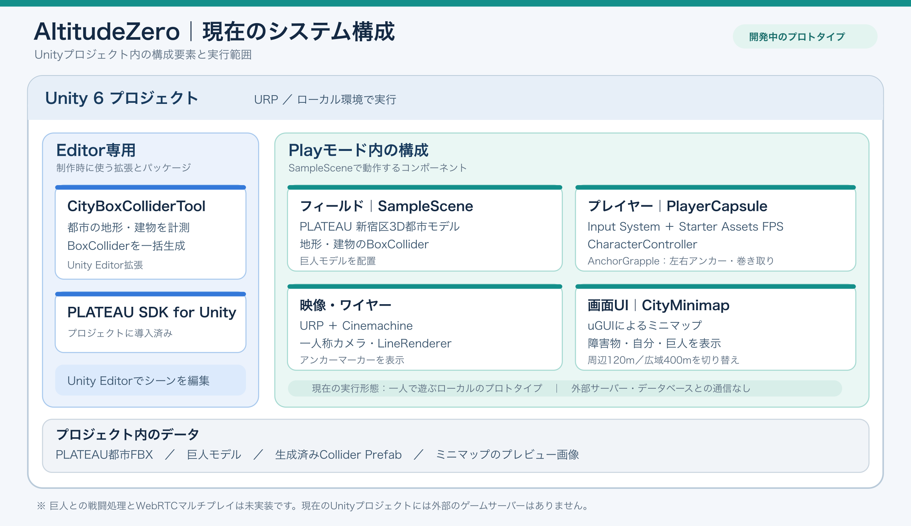

# AltitudeZero システム構成図

## ProtoPedia登録用の説明文

現在のシステムは、**Unity 6の単一プロジェクト内で動くローカルのプロトタイプ**です。Unity EditorにはPLATEAU SDK for Unityと独自の`CityBoxColliderTool`を導入しています。このEditor拡張で都市モデルに合わせたBoxColliderを生成し、プロジェクト内のPrefabとして保存しています。

Playモードの`SampleScene`には、PLATEAUの新宿区3D都市モデル、生成した地形・建物のBoxCollider、巨人モデルを配置しています。`PlayerCapsule`にはInput System、Starter AssetsのFPSコントローラー、`CharacterController`、左右のワイヤー移動を担う独自の`AnchorGrapple`が付いています。

映像にはURPとCinemachineを使い、ワイヤーはLineRendererで表示します。画面UIはuGUIの`CityMinimap`で、障害物と自分・巨人の位置を表示します。**外部サーバーやデータベースとの通信はありません。**巨人との戦闘処理とWebRTCによるマルチプレイは、今後の実装予定です。

## 画像ファイル

- `ProtoPediaSystemArchitecture.png`：ProtoPediaへの画像アップロード用（2400 × 1387 px）
- `ProtoPediaSystemArchitecture.svg`：拡大・編集用
